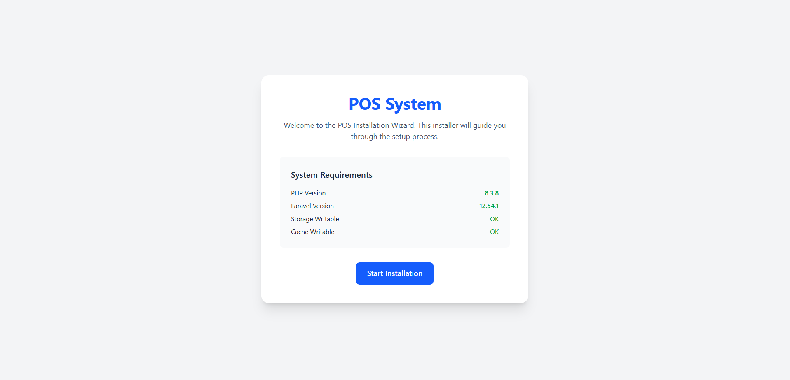
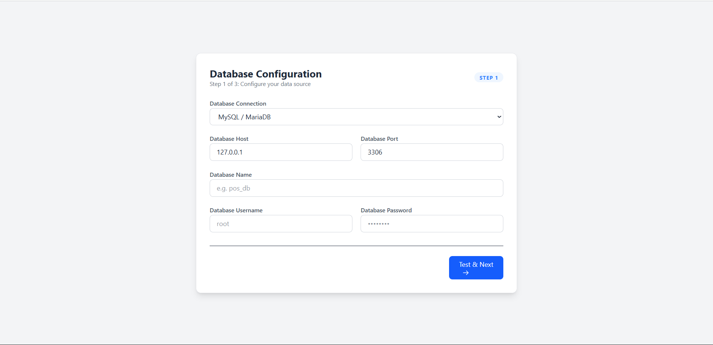
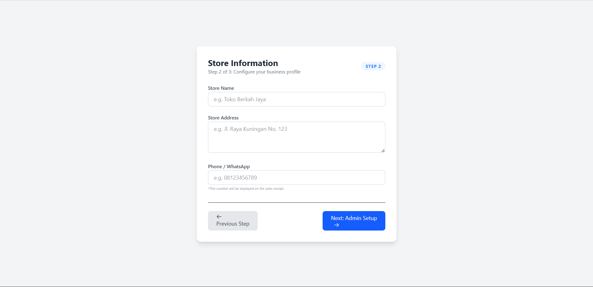
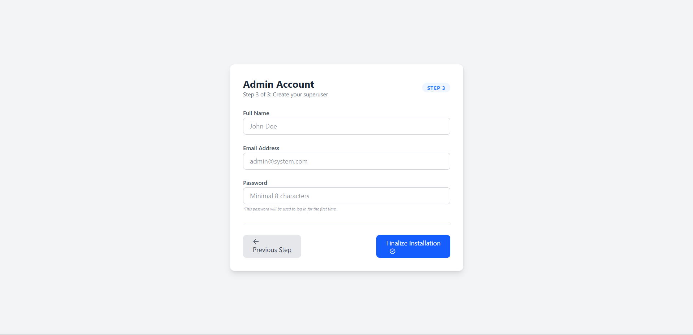
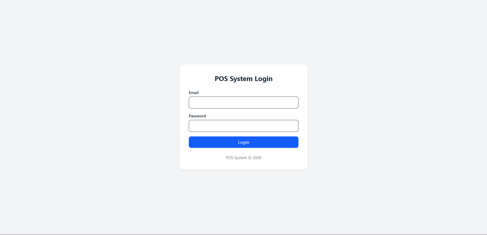
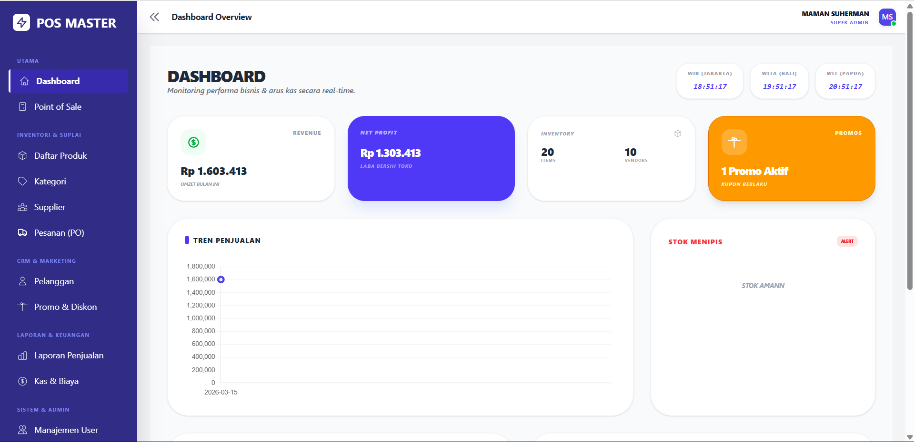
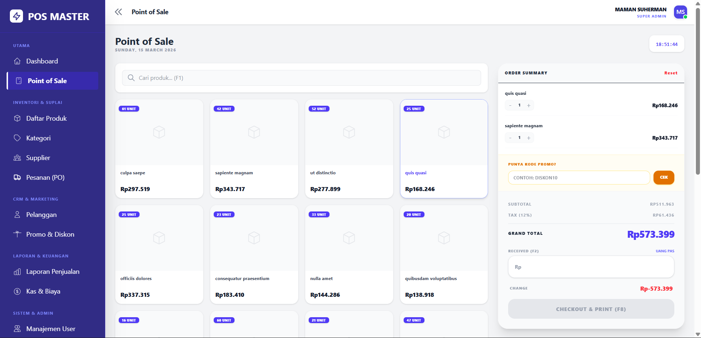

# 🛒 Sistem POS (Point of Sale)

Aplikasi web **Point of Sale (POS)** yang lengkap, dibangun dengan **Laravel**, dirancang untuk bisnis ritel skala kecil hingga menengah. Dilengkapi dengan installer terpandu, antarmuka kasir, manajemen inventaris, mesin promo/diskon, pesanan pembelian, dan laporan keuangan.

---

## 📸 Tangkapan Layar

### 1. Installer — Persyaratan Sistem



> Halaman pembuka installer menampilkan versi PHP, Laravel, dan status izin folder `storage` & `cache` sebelum proses setup dimulai.

---

### 2. Installer — Konfigurasi Database (Langkah 1 dari 3)



> Konfigurasi koneksi database: pilih driver (MySQL/MariaDB, PostgreSQL, SQLite, SQL Server), isi host, port, nama database, username, dan password. Tombol **Uji & Lanjut** memvalidasi koneksi sebelum melanjutkan ke langkah berikutnya.

---

### 3. Installer — Informasi Toko (Langkah 2 dari 3)



> Input profil bisnis: nama toko, alamat, dan nomor telepon/WhatsApp yang akan ditampilkan di struk penjualan.

---

### 4. Installer — Akun Admin (Langkah 3 dari 3)



> Pembuatan akun superuser pertama: nama lengkap, email, dan password minimal 8 karakter. Klik **Selesaikan Instalasi** untuk menjalankan migrasi dan mengunci installer.

---

### 5. Login



> Halaman login yang muncul setelah instalasi selesai. Gunakan email dan password yang dibuat pada Langkah 3 installer.

---

### 6. Ikhtisar Dashboard



> Dashboard utama menampilkan omzet bulan ini, laba bersih, jumlah produk & vendor, promo aktif, grafik tren penjualan 7 hari, dan notifikasi stok menipis — semuanya secara real-time.

---

### 7. Point of Sale (Kasir)



> Halaman kasir dengan tampilan grid produk, pencarian cepat (F1), input kode promo, kalkulasi subtotal + pajak 12%, dan tombol **Checkout & Cetak** (F8). Ringkasan pesanan diperbarui otomatis saat produk dipilih.

---

| Modul                         | Deskripsi                                                                                                                      |
| ----------------------------- | ------------------------------------------------------------------------------------------------------------------------------ |
| 🖥️ **Kasir (POS)**            | Antarmuka transaksi cepat dengan pengecekan stok real-time, kode promo, kalkulasi pajak, dan tampilan kembalian                |
| 📦 **Manajemen Produk**       | Tambah/ubah/hapus produk beserta gambar, kategori, dan tautan supplier                                                         |
| 🏷️ **Manajemen Kategori**     | Kelola kategori produk; penghapusan diproteksi jika produk masih terhubung                                                     |
| 🤝 **Manajemen Supplier**     | Lacak supplier yang terhubung ke produk dan pesanan pembelian                                                                  |
| 🛒 **Pesanan Pembelian**      | Buat pesanan pembelian, terima stok, dan perbarui inventaris secara otomatis                                                   |
| 🎟️ **Mesin Promo / Diskon**   | Buat kode promo persentase atau potongan tetap dengan tanggal kedaluwarsa, batas penggunaan, dan syarat minimal pembelian      |
| 👤 **Manajemen Pengguna**     | Kelola akun admin, kasir, dan pemilik dengan foto profil dan status aktif/nonaktif                                             |
| 💸 **Pencatatan Pengeluaran** | Catat pengeluaran bisnis dengan kategori dan nomor referensi yang dibuat otomatis                                              |
| 📊 **Dashboard**              | Ringkasan pendapatan, pengeluaran, dan laba bersih secara real-time dengan grafik penjualan 7 hari dan peringatan stok menipis |
| 🔧 **Installer Berbasis Web** | Installer GUI multi-langkah — tidak perlu terminal untuk setup awal                                                            |

---

## 🛠️ Tumpukan Teknologi

- **Framework:** Laravel 12
- **Bahasa:** PHP 8.1+
- **Database:** MySQL / PostgreSQL / SQLite / SQL Server
- **Frontend:** Blade templating, Tailwind CSS v4, JavaScript (Fetch API untuk POS)
- **Build Tool:** Vite
- **Penyimpanan:** Laravel Filesystem (disk lokal/publik untuk gambar produk & profil)

---

## ⚙️ Persyaratan Sistem

- PHP >= 8.1
- Composer
- Node.js >= 16 & NPM >= 8 (untuk Vite + Tailwind CSS)
- Database yang didukung (MySQL direkomendasikan)
- Web server: Apache / Nginx (atau `php artisan serve` untuk penggunaan lokal)

---

## 🚀 Panduan Setup Lengkap

### Prasyarat

Pastikan semua alat berikut sudah terpasang di komputer kamu sebelum memulai:

| Alat     | Versi Minimum | Cek Versi         |
| -------- | ------------- | ----------------- |
| PHP      | 8.1           | `php -v`          |
| Composer | 2.x           | `composer -V`     |
| Node.js  | 16.x          | `node -v`         |
| NPM      | 8.x           | `npm -v`          |
| MySQL    | 5.7 / 8.x     | `mysql --version` |
| Git      | bebas         | `git --version`   |

> **Rekomendasi lokal**: Gunakan [Laragon](https://laragon.org/) (Windows) atau [Herd](https://herd.laravel.com/) (Mac) agar PHP, MySQL, dan virtual host sudah tersedia secara otomatis.

---

### Langkah 1 — Clone & Masuk ke Folder Proyek

```bash
git clone https://github.com/your-username/your-repo.git
cd your-repo
```

---

### Langkah 2 — Instal Dependensi PHP

```bash
composer install
```

> Jika muncul error `PHP extension not found`, pastikan ekstensi berikut sudah aktif di `php.ini`:
> `ext-pdo`, `ext-mbstring`, `ext-openssl`, `ext-tokenizer`, `ext-xml`, `ext-fileinfo`, `ext-gd`

---

### Langkah 3 — Instal Dependensi Frontend & Setup Tailwind CSS

**Instal semua package NPM:**

```bash
npm install
```

**Instal Tailwind CSS v4:**

```bash
npm install -D tailwindcss @tailwindcss/vite
```

**Tambahkan plugin Tailwind ke `vite.config.js`:**

```js
import { defineConfig } from "vite";
import laravel from "laravel-vite-plugin";
import tailwindcss from "@tailwindcss/vite";

export default defineConfig({
    plugins: [
        laravel({
            input: ["resources/css/app.css", "resources/js/app.js"],
            refresh: true,
        }),
        tailwindcss(),
    ],
});
```

**Ganti isi `resources/css/app.css` dengan:**

```css
@import "tailwindcss";
```

> Di Tailwind v4, tidak perlu file `tailwind.config.js` maupun direktif `@tailwind base/components/utilities`. Satu baris impor ini sudah cukup — pemindaian konten dilakukan secara otomatis oleh plugin Vite.

**Pastikan layout utama memuat aset via `@vite` di dalam `<head>`:**

```html
<head>
    <meta charset="UTF-8" />
    <meta name="viewport" content="width=device-width, initial-scale=1.0" />
    <title>{{ config('app.name') }}</title>
    @vite(['resources/css/app.css', 'resources/js/app.js'])
</head>
```

> Jika ada beberapa file layout (misalnya layout terpisah untuk installer), tambahkan `@vite` ke masing-masing file tersebut.

**Build aset:**

```bash
# Mode pengembangan (dengan hot-reload)
npm run dev

# Mode produksi
npm run build
```

> Untuk mode pengembangan, jalankan `npm run dev` di terminal terpisah selagi `php artisan serve` berjalan.

---

### Langkah 4 — Buat File Environment

```bash
cp .env.example .env
php artisan key:generate
```

File `.env` yang baru dibuat akan berisi `APP_KEY` yang sudah terisi secara otomatis. Kamu **tidak perlu** mengisi `DB_*` secara manual jika menggunakan Installer Berbasis Web (Langkah 6).

---

### Langkah 5 — Atur Izin & Tautan Storage

```bash
# Linux / Mac
chmod -R 775 storage bootstrap/cache
chown -R www-data:www-data storage bootstrap/cache  # sesuaikan dengan user web server kamu

# Buat symlink storage agar file yang diunggah bisa diakses publik
php artisan storage:link
```

> **Windows (Laragon/XAMPP):** Izin tidak perlu diubah. Cukup jalankan `php artisan storage:link` saja.

---

### Langkah 6 — Setup Database

#### Opsi A — Installer Berbasis Web ✅ (Direkomendasikan)

Tidak perlu menyentuh database secara manual. Jalankan server terlebih dahulu:

```bash
php artisan serve
```

Kemudian buka browser dan akses:

```text
http://localhost:8000/install
```

Installer akan memandu kamu melalui 4 langkah:

```text
[Langkah 1] Koneksi Database
             → Masukkan host, port, nama DB, username, password
             → Database akan dibuat otomatis jika belum ada (MySQL)
             ↓
[Langkah 2] Informasi Toko
             → Nama toko, alamat, nomor telepon
             ↓
[Langkah 3] Akun Admin
             → Nama, email, dan password untuk login pertama kali
             ↓
[Langkah 4] Proses Instalasi
             → Migrasi database berjalan otomatis
             → Data toko & akun admin tersimpan
             → File .env diperbarui secara permanen
             → Installer dikunci (tidak bisa diakses lagi)
```

Setelah selesai, kamu akan diarahkan ke halaman login.

#### Opsi B — Manual via Terminal

1. Buat database kosong di MySQL:

    ```sql
    CREATE DATABASE nama_database CHARACTER SET utf8mb4 COLLATE utf8mb4_unicode_ci;
    ```

2. Isi konfigurasi database di file `.env`:

    ```env
    DB_CONNECTION=mysql
    DB_HOST=127.0.0.1
    DB_PORT=3306
    DB_DATABASE=nama_database
    DB_USERNAME=root
    DB_PASSWORD=password_kamu

    APP_NAME="Laravel POS"
    APP_URL=http://localhost:8000
    ```

3. Jalankan migrasi:

    ```bash
    php artisan migrate
    ```

4. Buat akun admin pertama (jika tidak ada seeder):

    ```bash
    php artisan tinker
    ```

    ```php
    \App\Models\User::create([
        'name'      => 'Admin',
        'email'     => 'admin@example.com',
        'password'  => \Illuminate\Support\Facades\Hash::make('password123'),
        'role'      => 'admin',
        'is_active' => true,
    ]);
    ```

5. Buat file kunci installer agar middleware tidak memblokir akses:

    ```bash
    echo "installed" > storage/installed
    ```

6. Jalankan server:

    ```bash
    php artisan serve
    ```

---

### Langkah 7 — Buka Aplikasi

```text
http://localhost:8000/login
```

Login dengan akun admin yang dibuat pada langkah sebelumnya, lalu mulai konfigurasi:

1. **Pengaturan** → Isi nama toko, alamat, dan nomor telepon
2. **Kategori** → Tambah kategori produk
3. **Supplier** → Tambah data supplier
4. **Produk** → Tambah produk dengan harga dan stok awal
5. **Pengguna** → Tambah akun kasir jika diperlukan
6. **Promo** _(opsional)_ → Buat kode diskon untuk promosi

Setelah itu, akses halaman **Kasir** (`/sales/create`) untuk mulai bertransaksi.

---

### Pemecahan Masalah Umum

| Error                                              | Solusi                                                                                                         |
| -------------------------------------------------- | -------------------------------------------------------------------------------------------------------------- |
| `No application encryption key has been specified` | Jalankan `php artisan key:generate`                                                                            |
| `SQLSTATE: Access denied`                          | Periksa `DB_USERNAME` dan `DB_PASSWORD` di file `.env`                                                         |
| `Target class [installed] does not exist`          | Daftarkan middleware di `bootstrap/app.php` (Laravel 12)                                                       |
| Foto produk tidak muncul                           | Jalankan `php artisan storage:link`                                                                            |
| Halaman installer terus muncul                     | Buat file `storage/installed` secara manual                                                                    |
| `composer install` gagal                           | Pastikan PHP >= 8.1 dan ekstensi yang dibutuhkan sudah aktif                                                   |
| `npm run build` gagal                              | Pastikan Node.js >= 16, hapus folder `node_modules` lalu jalankan `npm install` ulang                          |
| Class Tailwind tidak muncul                        | Pastikan `@vite` ada di `<head>` layout dan sudah menjalankan `npm run dev` atau `npm run build`               |
| Class dinamis Tailwind tidak ter-generate          | Tulis class secara eksplisit — Tailwind v4 tidak bisa memindai string template seperti `` `bg-${color}-500` `` |

---

## 👤 Peran Pengguna Bawaan

| Peran     | Akses                                                |
| --------- | ---------------------------------------------------- |
| `owner`   | Akses penuh termasuk laporan keuangan dan pengaturan |
| `admin`   | Akses penuh termasuk manajemen pengguna dan produk   |
| `cashier` | Layar POS dan riwayat transaksi milik sendiri        |

Akun admin pertama dibuat saat proses instalasi.

---

## 📁 Controller Utama

```text
app/Http/Controllers/
├── InstallerController.php   # Installer berbasis web multi-langkah
├── DashboardController.php   # Statistik, grafik, dan peringatan stok menipis
├── SalesController.php       # Transaksi POS dengan logika promo & pajak
├── PromoController.php       # CRUD promo + API validasi kode real-time
├── ProductsController.php    # CRUD produk dengan unggah gambar
├── CategoryController.php    # Manajemen kategori (dengan penjaga penghapusan)
├── SupplierController.php    # CRUD supplier dengan penjaga tautan produk
├── UserController.php        # Manajemen pengguna dengan foto profil
├── PurchaseController.php    # Pesanan pembelian dan penerimaan stok
├── ExpensesController.php    # Pencatatan pengeluaran dan ringkasan keuangan
└── SettingsController.php    # Pengaturan nama toko, alamat, dan nomor telepon

app/Http/Middleware/
├── CheckInstalled.php        # Mengarahkan ke installer jika belum setup; memblokir instalasi ulang
└── AutoMigrate.php           # Menjalankan migrasi yang tertunda secara otomatis pada setiap permintaan
```

---

## 🧾 Alur Transaksi POS

```text
Kasir memindai/memilih produk
        ↓
Subtotal dihitung di sisi klien
        ↓
Opsional: terapkan kode promo (divalidasi via API)
        ↓
Pajak dihitung dari (Subtotal − Diskon)
        ↓
Pelanggan membayar → kembalian ditampilkan
        ↓
Server memvalidasi → stok dikurangi → faktur disimpan
```

Semua kalkulasi akhir **divalidasi ulang di sisi server** di `SalesController@store` untuk mencegah manipulasi dari sisi klien.

---

## 🎟️ Validasi Kode Promo

Endpoint `POST /promos/check` memvalidasi kode promo secara real-time. Pemeriksaan yang dilakukan:

1. Keberadaan kode
2. Status aktif (`is_active = true`)
3. Rentang tanggal berlaku (`start_date` ≤ hari ini ≤ `end_date`)
4. Kuota penggunaan (`used_count < usage_limit`)
5. Syarat minimal pembelian (`subtotal >= min_purchase`)

Jika valid, endpoint mengembalikan `discount_value` yang sudah dihitung berdasarkan subtotal yang diberikan.

---

## 📊 Metrik Dashboard

- **Total produk** dan **promo aktif**
- **Pendapatan bulanan**, **pengeluaran bulanan**, dan **laba bersih**
- **Grafik penjualan 7 hari** (agregasi harian)
- **Peringatan stok menipis** — produk dengan stok ≤ 5

---

## 🗂️ Gambaran Umum Database

| Tabel            | Fungsi                           |
| ---------------- | -------------------------------- |
| `users`          | Autentikasi dan manajemen peran  |
| `products`       | Katalog produk                   |
| `categories`     | Kategori produk                  |
| `suppliers`      | Data supplier                    |
| `sales`          | Header transaksi penjualan       |
| `sales_items`    | Baris detail transaksi penjualan |
| `promos`         | Definisi kode diskon / promo     |
| `purchases`      | Header pesanan pembelian         |
| `purchase_items` | Baris detail pesanan pembelian   |
| `expenses`       | Catatan pengeluaran              |
| `settings`       | Nama toko, alamat, nomor telepon |

---

## 🗺️ Ikhtisar Rute

| Grup                                     | Middleware                          | Keterangan                                         |
| ---------------------------------------- | ----------------------------------- | -------------------------------------------------- |
| `/`                                      | —                                   | Halaman sambutan / landing page                    |
| `/login`, `POST /login`                  | `installed`                         | Autentikasi tamu                                   |
| `/logout`                                | —                                   | Logout sesi                                        |
| `/install/*`                             | `CheckInstalled`                    | Langkah-langkah installer (diblokir setelah setup) |
| `/dashboard`                             | `auth`, `installed`, `auto-migrate` | Titik masuk utama aplikasi                         |
| `/products`, `/categories`, `/suppliers` | `auth`                              | Manajemen inventaris                               |
| `/purchases`, `/sales`, `/expenses`      | `auth`                              | Operasional & transaksi                            |
| `/promos`, `/users`                      | `auth`                              | Pemasaran & kontrol akses                          |
| `POST /promos/check`                     | `auth`                              | Validasi kode promo real-time (AJAX)               |
| `/settings`                              | `auth`                              | Pengaturan toko (GET + POST)                       |

---

## 🔒 Catatan Keamanan

- Password di-hash menggunakan `Hash::make()` milik Laravel (bcrypt)
- Proteksi CSRF diaktifkan pada semua formulir
- Kode promo dan stok **divalidasi ulang di sisi server** pada setiap transaksi
- Installer dinonaktifkan secara otomatis setelah setup berhasil (file kunci `storage/installed`)
- Middleware `CheckInstalled` mencegah pengulangan installer setelah file kunci ada
- Middleware `AutoMigrate` menerapkan migrasi yang tertunda saat startup — berguna setelah deployment
- Penghapusan supplier diproteksi: supplier yang masih terhubung ke produk tidak bisa dihapus
- Penghapusan kategori diproteksi: kategori yang masih terhubung ke produk tidak bisa dihapus
- Kredensial database yang sensitif ditulis ke `.env` saat instalasi dan tidak diekspos kembali pada permintaan berikutnya

---

## 📜 Lisensi

Proyek ini adalah open-source di bawah [Lisensi MIT](LICENSE).

---

## 🤝 Kontribusi

Pull request sangat disambut. Untuk perubahan besar, silakan buka issue terlebih dahulu untuk mendiskusikan apa yang ingin kamu ubah.

1. Fork repositori ini
2. Buat branch fitur: `git checkout -b fitur/nama-fitur-kamu`
3. Commit perubahan: `git commit -m 'Tambah fitur kamu'`
4. Push ke branch: `git push origin fitur/nama-fitur-kamu`
5. Buka Pull Request
